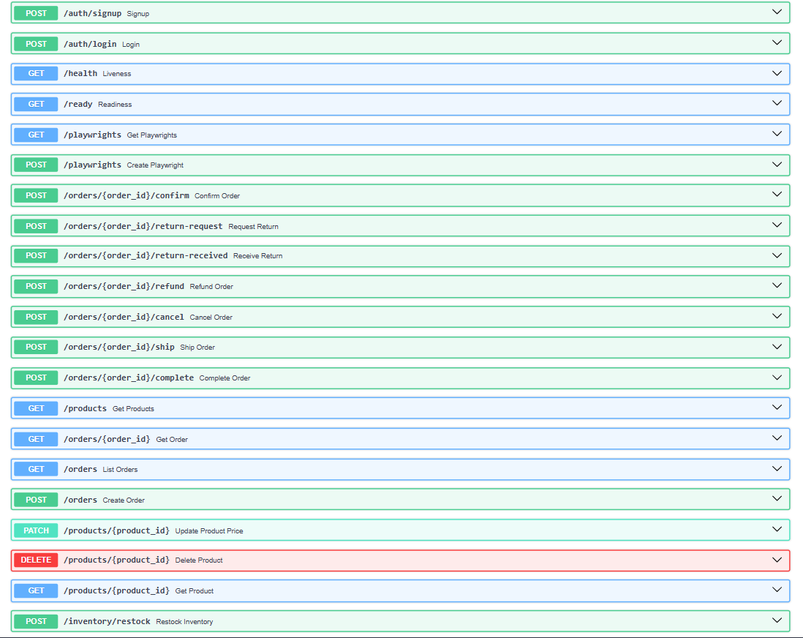
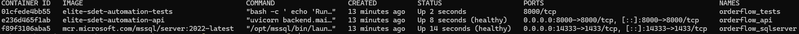
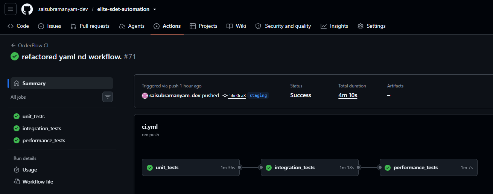

# OrderFlow - Production-Grade Order Processing & Test Automation Framework

[](https://www.python.org/)
[](https://fastapi.tiangolo.com/)
[](https://pytest.org/)
[](https://www.microsoft.com/sql-server)
[](https://www.docker.com/)
[](https://github.com/features/actions)

OrderFlow is a production-style order processing system designed to demonstrate concurrency-safe order processing, idempotent API design, transactional integrity, and end-to-end automation testing.

Built with FastAPI, SQL Server, Docker, and GitHub Actions, the project validates business-critical workflows through automated API, database, integration, system, end-to-end, and performance tests.

The project simulates real-world backend workflows using FastAPI, SQL Server, Docker, and PyTest while validating business-critical scenarios through automated API, database, integration, system, end-to-end, and performance tests.
---

## Overview

Modern distributed systems must remain correct under concurrent requests, retries, transaction failures, and inventory contention. OrderFlow demonstrates how these challenges can be addressed using transactional database operations, row-level locking, idempotent APIs, and automated validation.

The project includes:

- Concurrency-safe order processing
- Idempotent REST APIs
- Atomic SQL transactions
- Inventory consistency validation
- State-driven order lifecycle
- Dockerized execution
- CI/CD using GitHub Actions
---

## Technology Stack

| Layer | Technology |
|--------|------------|
| Backend | FastAPI |
| Database | Microsoft SQL Server 2022 |
| Testing | PyTest, Playwright |
| API Validation | Requests |
| Database Validation | pyodbc |
| Containerization | Docker, Docker Compose |
| CI/CD | GitHub Actions |
| Architecture | Repository + Service Pattern |
| Test Types | Unit, Integration, System, End-to-End, Performance |
| Current Status | 102 Automated Tests Passing |
---
## Engineering Challenges Solved

OrderFlow is designed to address common challenges found in distributed order processing systems.

### 1. Concurrent Order Processing

**Scenario**

Two customers attempt to purchase the last available item at the same time.

```text
Customer A ─────► Order Created
Customer B ─────► 409 Conflict (Out of Stock)
```

**Implementation**

- Atomic inventory updates
- SQL Server row-level locking (`UPDLOCK`, `ROWLOCK`)
- Transaction boundaries with explicit commit and rollback

**Outcome**

Overselling is prevented while maintaining inventory consistency.

---

### 2. Idempotent Order Creation

**Scenario**

A client retries the same request because of a timeout or network interruption.

```text
Request 1 (Idempotency-Key: abc123)
        │
        ▼
Order Created

Request 2 (Idempotency-Key: abc123)
        │
        ▼
Existing Order Returned
```

**Implementation**

- Unique constraint on `idempotency_key`
- Idempotency-Key request header
- Duplicate request detection

**Outcome**

Repeated requests never create duplicate orders.

---

### 3. Transaction Rollback

**Scenario**

An order is cancelled after inventory has already been deducted.

```text
Before Cancel
Stock = 0

Cancel Order

After Cancel
Stock = 1
```

**Implementation**

- Explicit SQL transactions
- Commit and rollback
- Inventory restoration

**Outcome**

Database consistency is preserved even when business operations fail.
---

## Architecture

OrderFlow follows a layered architecture that separates API routing, business logic, data access, and domain rules. This separation improves maintainability, testability, and scalability.

```text
                   Client / Test Suite
                            │
                            ▼
                  FastAPI REST API
                            │
                  Request Validation
                            │
                            ▼
                  Service Layer
           ┌────────────────┴────────────────┐
           │                                 │
     Order Service                   Auth Service
           │                                 │
           └────────────────┬────────────────┘
                            ▼
                 Repository Layer
           ┌────────────────┴────────────────┐
           │                                 │
     Order Repository                User Repository
                            │
                            ▼
                    SQL Server Database
```

### Design Principles

- Layered architecture with clear separation of concerns
- Repository pattern for database abstraction
- Service layer for business rules and transaction management
- Domain-driven order state transitions
- Pydantic models for request and response validation
- SQL Server transactions for data consistency

---

## Test Strategy

The project validates functionality at multiple testing layers to ensure business correctness, database integrity, API reliability, and production readiness.

| Test Layer | Purpose |
|------------|---------|
| Unit Tests | Validate business logic and state transitions |
| API Tests | Verify REST endpoints, request validation, and responses |
| Database Tests | Validate schema, constraints, and transactional behavior |
| Integration Tests | Verify interaction between API and SQL Server |
| System Tests | Validate complete business workflows |
| End-to-End Tests | Verify complete order lifecycle and concurrency scenarios |
| Performance Tests | Measure API response times and SLA compliance |

Current Status

- **102 automated tests passing**
- API, Database, Service, and End-to-End coverage
- Excel report generation after every execution
- Docker-based execution for reproducible test environments

---

## Project Structure

The project is organized using a layered architecture that separates business logic, data access, domain rules, configuration, reporting, and automated testing.

| Directory | Responsibility |
|-----------|----------------|
| `backend/` | FastAPI application, business logic, repositories, schemas, and domain rules |
| `config/` | Application configuration and environment settings |
| `core/` | Shared utilities, reusable API client, and failure classification |
| `tests/` | Unit, API, Database, Integration, System, End-to-End, and Performance tests |
| `reporting/` | Excel report generation for automated test execution |
| `reports/` | Generated reports, screenshots, and execution artifacts |
| `docker-compose.yml` | Multi-container orchestration for API, SQL Server, and test execution |
| `Dockerfile` | Builds the application image |
| `schema.sql` | Database schema |
| `init.sql` | Database initialization script |
| `pytest.ini` | PyTest configuration |
| `conftest.py` | Shared fixtures and test configuration |

---
## REST API

OrderFlow exposes RESTful endpoints for authentication, product management, inventory management, health monitoring, and order processing.

### Authentication

| Method | Endpoint | Description |
|---------|----------|-------------|
| POST | `/auth/signup` | Register a new user |
| POST | `/auth/login` | Authenticate a user |

### Health

| Method | Endpoint | Description |
|---------|----------|-------------|
| GET | `/health` | Liveness endpoint |
| GET | `/ready` | Readiness endpoint |

### Products

| Method | Endpoint | Description |
|---------|----------|-------------|
| GET | `/products` | Retrieve all products |
| GET | `/products/{product_id}` | Retrieve a product by ID |
| PATCH | `/products/{product_id}` | Update product price |
| DELETE | `/products/{product_id}` | Delete a product |

### Inventory

| Method | Endpoint | Description |
|---------|----------|-------------|
| POST | `/inventory/restock` | Restock inventory |

### Orders

| Method | Endpoint | Description |
|---------|----------|-------------|
| POST | `/orders` | Create a new order |
| GET | `/orders` | Retrieve all orders |
| GET | `/orders/{order_id}` | Retrieve an order by ID |
| POST | `/orders/{order_id}/confirm` | Confirm an order |
| POST | `/orders/{order_id}/ship` | Ship an order |
| POST | `/orders/{order_id}/complete` | Complete an order |
| POST | `/orders/{order_id}/cancel` | Cancel an order |
| POST | `/orders/{order_id}/return-request` | Request a return |
| POST | `/orders/{order_id}/return-received` | Mark returned item as received |
| POST | `/orders/{order_id}/refund` | Refund an order |

---

### API Documentation

The project exposes interactive API documentation using FastAPI's built-in Swagger UI.



---


## API Design

The REST API follows production-oriented design principles.

- Stateless request processing
- Idempotent order creation using an `Idempotency-Key`
- Request and response validation using Pydantic
- Proper HTTP status codes
- Transaction-safe order processing
- Inventory consistency through SQL transactions
- Docker health check endpoints

---
## Getting Started

### Clone Repository

```bash
git clone https://github.com/saisubramanyam-dev/elite-sdet-automation.git
cd elite-sdet-automation
```

---

## Quick Start (Docker)

The recommended way to run OrderFlow is using Docker Compose. This provisions SQL Server, initializes the database, starts the FastAPI application, and executes the complete automated test suite.

### Run the Complete Stack

```bash
docker compose down -v
docker compose up --build --abort-on-container-exit
```

### Alternative

Run only the test container output while hiding the SQL Server and API container logs.

```bash
docker compose up --abort-on-container-exit --no-attach sqlserver --no-attach api
```

### Docker Services

| Service | Description |
|---------|-------------|
| `orderflow_sqlserver` | SQL Server 2022 database |
| `orderflow_api` | FastAPI application |
| `orderflow_tests` | Executes the complete automated test suite |

### Running Containers

Docker Compose provisions the complete application stack, including SQL Server, the FastAPI backend, and the automated test runner.



During execution Docker Compose will:

- Start SQL Server
- Initialize the database
- Start the FastAPI application
- Wait until the API passes its health checks
- Execute the complete automated test suite
- Stop all containers after test execution

No local SQL Server installation is required.

---

## Local Development

### Prerequisites

Install the following software before running the project locally:

- Python 3.12+
- Git
- Docker Desktop
- Microsoft SQL Server ODBC Driver 18
- SQL Server Management Studio (Optional)

### Create a Virtual Environment

```bash
python -m venv .venv
```

### Activate the Virtual Environment

**Windows**

```bash
.venv\Scripts\activate
```

**Linux / macOS**

```bash
source .venv/bin/activate
```

### Install Dependencies

```bash
pip install -r requirements.txt
```

### Start the Application

```bash
uvicorn backend.main:app --reload
```

The API will be available at:

```text
http://localhost:8000
```

Interactive API documentation:

```text
http://localhost:8000/docs
```

### Execute the Test Suite

```bash
pytest -v -s
```

---


## CI/CD Pipeline

OrderFlow uses GitHub Actions to automatically validate every push and pull request.

### GitHub Actions Workflow

The project uses GitHub Actions to build, test, and validate every code change.



The pipeline performs the following steps:

1. Builds the Docker image
2. Starts SQL Server 2022
3. Initializes the database schema
4. Starts the FastAPI application
5. Waits for health checks to pass
6. Executes the complete automated test suite
7. Publishes test results
8. Fails the pipeline immediately if any test fails

---

### Pipeline Stages

| Stage | Description |
|--------|-------------|
| Unit Tests | Validates business logic |
| API Tests | Verifies REST API functionality |
| Database Tests | Validates schema and transactional behavior |
| End-to-End Tests | Tests complete business workflows |
| System Tests | Verifies cross-component interactions |
| Performance Tests | Validates SLA requirements |

The CI pipeline ensures every code change is automatically validated before being merged.

---

## Test Reports

Every execution generates structured reports that simplify debugging and execution analysis.

Generated artifacts include:

- Excel execution reports
- PyTest logs
- Docker container logs
- Coverage reports
- Failure screenshots (when applicable)

These reports help identify failures, validate execution history, and simplify root-cause analysis.

---


## Production Engineering Practices

OrderFlow follows engineering practices commonly used in production backend systems.

- Layered Architecture
- Repository Pattern
- Service Layer
- Domain Layer
- Atomic SQL Transactions
- Row-Level Locking
- Idempotent API Design
- Structured Logging
- Health Checks
- Dockerized Deployment
- Continuous Integration
- Automated Regression Testing

---
## Project Status

OrderFlow is a production-style backend application and automation framework demonstrating modern software engineering and testing practices.

### Current Capabilities

- Layered FastAPI architecture
- SQL Server integration
- Dockerized development and testing
- Automated CI/CD with GitHub Actions
- Concurrency-safe order processing
- Idempotent REST API design
- Atomic SQL transactions
- API, Database, Unit, System, End-to-End, and Performance testing
- 102 automated tests passing

---

## Author

Sai Subramanyam

Software Development Engineer in Test (SDET)

If you have feedback or suggestions, feel free to open an issue or submit a pull request.